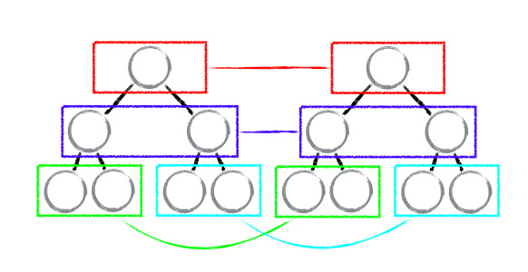
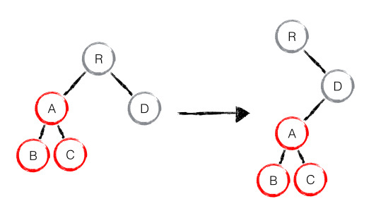
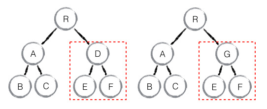
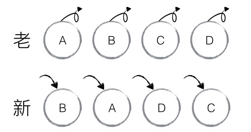
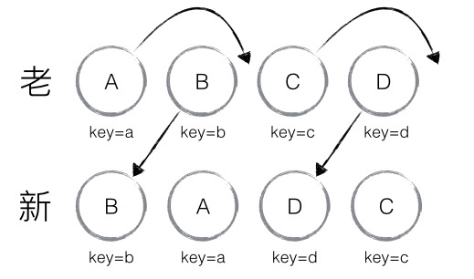
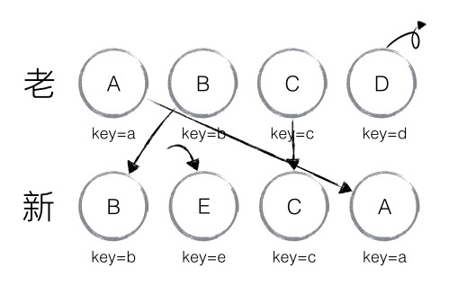

# diff 分析
  React 中最值得称道的部分莫过于Virtual DOM 与diff的完美结合，特别是其高效的 diff 算法，让用户可以无需顾忌性能问题而“任性自由”的刷新页面，让开发者也可以无需关心Virthual DOM背后的运作原理，因为 React diff 会帮助我们计算出 Virtual DOM 中真正变化的部分，并只针对该部分进行实际DOM操作，而非重新渲染整个页面，从而保证了每次操作更新后面的高效渲染，因此 Virtual DOM 与 diff 是保证 React 性能口碑的幕后推手。<br>

# 传统 diff 算法
  计算一棵树形结构转换成另一棵树形结构的最少操作，是一个复杂且值得研究的问题。传统 diff 算法通过循环递归对节点进行依次对比，效率低下，算法复杂度达到O(n³)，其中 n 是树中节点的总数。O(n³)到底有多可怕，这意味着如果要展示1000个节点，就要依次执行上十亿次的比较。这种指数型的性能消耗对于前端渲染场景来说代价太高了！现今的CPU每秒钟能执行大约30亿条执行，即便是最高效的实现，也不可能在一秒内计算出差异情况。<br>

  因此，如果 React 只是单纯的引入 diff 算法而没有任何的优化改进，那么其效率是远远无法满足前端渲染所需求的性能。<br>

  通过下面的 demo 可以清晰的描述传统 diff 算法的实现过程。
```
  let result = [];

  //比较叶子节点
  const diffLeafs = function(beforeLeaf, afterLeaf){
    // 获取较大节点树的长度
    left count = Math.max(beforeLeaf.children.length, afterLeaf.children.length);

    for(let i=0; i<count; i++){
      const beforeTag = beforeLeaf.children[i]
      const afterTag = afterLeaf.children[i];

      // 添加 afterTag 节点
      if(beforeTag === undefined){
        result.push({ type: "add", element: afterTag })

        //删除 beforeTag 节点
      } else if(afterTag === undefined){
        result.push({ type: "remove", element: beforeTag})

        //节点改变时，删除 beforeTag 节点，添加 afterTag 节点
      } else if(beforeTag.tagName !== afterTag.tagName){
        result.push({ type: "remove", element: beforeTag })
        result.push({ type: "add", lement: afterTag })

        //节点不变而内容改变时，改变节点
      } else if(beforeTag.innerHTML !== afterTag.innerHTML){
        if(beforeTag.children.length === 0){
          result.push({
            type: "changed",
            beforeElement: beforeTag,
            afterElement: afterTag,
            html: afterTag.innerHTML
          });
        } else {
          diffLeafs(beforeTag, afterTag)
        }
      }
    }

    return result;
  }
```
# 详解 React diff

  React 通过制定大胆的策略，将O(n³)复杂度的问题转换成O(n)复杂度的问题。<br>

#### diff 策略
  1. Web UI 中 DOM 节点跨层级的移动操作特别少，可以忽略不计
  2. 拥有相同类的两个组件将会生成相似的树形结构，拥有不同类的两个组件将会生成不同的树形结构。
  3. 对于同一层级的一组子节点，它们可以通过唯一id进行区分

  基于以上三个前提策略， React 分别对 tree diff、component diff 以及 element diff 进行算法优化，事实也证明这三个前提策略是合理且准确的，它保证了整体界面构建的性能。
  * tree diff
  * component diff
  * element diff

### tree diff
  基于策略一， React 对树的算法进行了简洁明了的优化，即对树进行分层比较，两棵树只会对同一层次的节点进行比较。<br>

  既然 DOM 节点跨层级的移动操作少到可以忽略不计，针对这一现象，React 通过 updateDepth 对 Virtual DOM 树进行层级控制，只会对相同颜色方框内的 DOM 节点进行比较，即 同一个父节点下的所有子节点。当发现节点已经不存在，则该节点及其子节点会被完全删除掉，不会用于进一步的比较。这样只需要对树进行一次遍历，便能完成整个 DOM 树的比较。<br>
  

```
  updateChildren: function(nextNestedChildrenElements, transaction, context){
    updateDepth ++;
    var errorThrown = true;
    try{
      this._updateChildren(nextNestedChildrenElements, transaction, context)
      errorThrown = false;
    } finally {
      updateDepth --;
      if(!updateDepth){
        if(errorThrown){
          clearQueue();
        } else {
          processQueue();
        }
      }
    }
  }
```

  分析至此，大部分人可能都存在这样的疑问：`如果出现了 DOM 节点跨层级的移动操作，React diff会有怎样的表现呢？` <br>

  如下图，A 节点（包括其子节点）整个被移动到 D 节点下，由于 React 只会简单的考虑同层级节点的位置变换，而对于不同层级的节点，只有创建和删除操作。当根节点发现子节点中 A 消失了，就会直接销毁 A；当 D发现多了一个子节点 A，则会创建新的 A （包括子节点）作为其子节点。此时，React diff 的执行情况： create A -> create B -> create C -> delete A. <br>

  由此可发现，当出现节点跨层级移动时，并不会出现想象中的移动操作，而是以 A 为根节点的树被整个重新创建，这是一种影响 React 性能的操作，因此` React 官方建议不要进行 DOM 节点跨层级的操作。` <br>

  ```
    注意： 在开发组件时，保持稳定的 DOM 结构会有助于性能的提升。例如，可以通过 CSS 隐藏或显示节点，而不是真的移除或添加 DOM 节点
  ```
  

### component diff

  React 是基于组件构建应用的，对于组件间的比较所采取的策略也是简洁高效。

  * 如果是同一类型的组件，按照元策略继续比较 virtual DOM tree
  * 如果不是，则将该组件判断为 dirty component，从而替换整个组件下的所有子节点。
  * 对于同一类型的组件，有可能其Virtual DOM 没有任何变化，如果能够确切的知道这点可以节省大量的 diff 运算时间，因此 React 允许用户通过 shouldComponentUpdate() 来判断该组件是否需要进行diff

  如下图，当component D 改变为 component G 时，即使这两个 component 结构相似，一旦 React 判断 D 和 G 是不同类型的组件，就不会比较二者的结构，而是直接删除 component D，重新将建 component G 及其子节点。虽然当两个component 是不同类型但结构相似时，React diff 会影响性能，但正如 React 官方博客所言：不同类型的 component 是很少存在相似 DOM tree 的机会，因此这种极端因素很难在现实开发过程中造成重大影响。<br>

  

### element diff

  当节点处于同一层级时，React diff 提供了三种节点操作，分别为：INSERT_MARKUP(插入)、MOVE_EXISTING(移动)和REMOVE_NODE(删除)。<br>

  * INSERT_MARKUP，新的 component 类型不在老集合里，既是全新的节点，需要对新节点执行插入操作。
  * MOVE_EXISTING, 在老集合有新 component 类型，且 element 是可更新的类型，generateComponentChildren 已调用 receiveComponent，这种情况下 prevChild = nextChild，就需要做移动操作，可以复用以前的 DOM 节点。
  * REMOVE_NODE，老 component 类型，在新集合里也有，但对应的 element 不同则不能直接复用和更新，需要执行删除操作，或者老component 不在新集合里的，也需要执行删除操作。

```
  function enqueueInsertMarkup(parentInst, markup, toIndex){
    updateQueue.push({
      parentInst: parentInst,
      parentNode: null,
      type: ReactMultiChildUpdateTypes.INSERT_MARKUP,
      markupIndex: markupQueue.push(markup) - 1,
      content: null,
      fromIndex: null,
      toIndex: toIndex,
    });
  }

  function enqueueMove(parentInst, fromIndex, toIndex){
    updateQueue.push({
      parentInst: parentInst,
      parentNode: null,
      type: ReactMultiChildUpdateTypes.MOVE_EXISTING,
      markupIndex: null,
      content: null,
      fromIndex: fromIndex,
      toIndex: toIndex,
    });
  }

  function enqueueRemove(parentInst, fromIndex){
    updateQueue.push({
      parentInst: parentInst,
      parentNode: null,
      type: ReactMultiChildUpdateTypes.REMOVE_NODE,
      markupIndex: null,
      content: null,
      fromIndex: fromIndex,
      toIndex: null,
    })
  }
```

  如下图，老集合中包含节点A、B、C、D，更新后的新集合中包含节点：B、A、D、C，此时新老集合进行diff 差异化对比，发现 B != A，则创建并插入 B 至新集合，删除老集合 A；以此类推，创建并插入A、D 和 C，删除B，C 和 D。<br>

  

  React 发现这类操作繁琐冗余，因为这些都是相同的节点，但由于位置发生变化，导致需要进行繁杂低效的删除、创建操作，其实只要对这些节点进行位置移动即可。<br>

  针对这一现象，React提出优化策略：允许开发者对同一层级的同组自己点，添加唯一 key 进行区分，虽然只是小小的改动，性能上却发生了翻天覆地的变化！<br>

  新老集合所包含的节点，如下图所示，新老集合进行 diff 差异化对比，通过 key 发现新老集合中的节点都是相同的节点，因此无需进行节点删除和创建，只需要将老集合中节点的位置进行移动，更新为新集合中节点的位置，此时 React 给出的 diff 结果为：B、D 不做任何操作，A、C进行移动操作即可。<br>

  

### 源码详解

  首先对新集合的节点进行循环遍历，for(name in nextChild)，通过唯一 key 可以判断新老集合中是否存在相同的节点， if(prevChild === nextChild)，如果存在相同节点，则进行移动操作，但在移动前需要将当前节点在老集合中的位置与 lastIndex 进行比较，if(child.\_mountIndex < lastIndex) ，则进行节点移动操作，否则不执行该操作。这是一种顺序优化手段，lastIndex 一直在更新，表示访问过的节点在老集合中最右的位置（即最大的位置），如果新集合中当前访问的节点比 lastIndex 大，说明当前访问节点在老集合中就比上一个节点位置靠后，则该节点不会影响其他节点的位置，因此不用添加到差异队列中，即不执行移动操作，只有当访问的节点比lastIndex小时，才需要进行移动操作。<br>

  以上图为例，可以更为清洗直观的描述 diff 的差异对比过程：

  * 从新集合中取得 B，判断老集合中存在相同节点 B，通过对比节点位置判断是否进行移动操作，B 在老集合中的位置 B.\_mountIndex = 1，此时 lastIndex = 0，不满足 child.\_mountIndex < lastIndex 的条件，因此不对 B 进行移动操作；更新 lastIndex = Math.max(prevChild.\_mountIndex, lastIndex)，其中prevChild.\_mountIndex表示 B 在老集合中的位置，则 lastIndex = 1，并将 B 的位置更新为新集合中定的位置 prevChild.\_mountIndex = nextIndex,此时新集合中B.\_mountIndex = 0，nextIndex++ 进入下一个节点的判断。

  * 从新集合中取得 A，判断老集合中存在相同节点 A，通过对比节点位置判断是否进行移动操作，A 在老集合中的位置 A.\_mountIndex = 0，此时 lastIndex = 1，满足child.\_mountIndex < lastIndex 的条件，因此对 A 进行移动操作 enqueueMove(this, child.\_mountIndex, toIndex)，其中 toIndex 其实就是 nextIndex，表示 A 需要移动到的位置；更新 lastIndex = Math.max(prevChild.\_mountIndex, lastIndex), 则lastIndex = 1，并将 A 的位置更新为新集合中的位置 prevChld.\_mountIndex = nextIndex，此时新集合中A.\_mountIndex = 1， nextIndex++ 进入下一个节点的判断。

  * 从新集合中取得 D，判断老集合中存在相同节点 D，通过对比节点位置判断是否进行移动操作，D 在老集合中的位置 D.\_mountIndex = 3，此时 lastIndex = 1，不满足child.\_mountIndex < lastIndex 的条件，因此不对 D 进行移动操作；更新 lastIndex = Math.max(prevChild.\_mountIndex, lastIndex)，则 lastIndex = 3，并将 D 的位置更新为新集合中的位置 prevChild.\_mountIndex = nextIndex，此时新集合中 D.\_mountIndex = 2，nextIndex++进入下一个节点的判断。

  * 从新集合中取得 C，判断老集合中存在相同节点 C，通过对比节点位置判断是否进行移动操作，C 在老集合中的位置 C.\_mountIndex = 2，此时 lastIndex = 3，满足 child.\_mountIndex < lastIndex 的条件，因此对C 进行移动操作 enqueueMove(this, child.\_mountIndex, toIndex)；更新 lastIndex = Math.max(prevChild.\_mountIndex, lastIndex)，则 lastIndex = 3，并将 C 的位置更新为新集合中的位置 prevChild.\_mountIndex = nextIndex，此时新集合中 A.\_mountIndex = 3，nextIndex++ 进入下一个节点的判断，由于 C 已经是最后一个节点，因此 diff 到此完成。

  以上主要分析新老集合中存在相同节点但位置不同时，对节点进行位置移动的情况，如果新集合中有新加入的节点且老集合存在需要删除的节点，那么 React diff又是如何对比运作的？<br>

  以下图为例：

  * 从新集合中取得 B，判断老集合中存在相同节点 B，由于 B 在老集合中的位置 B.\_mountIndex = 1，此时lastIndex = 0，因此不对 B 进行移动操作；更新 lastIndex = 1，并将 B 的位置更新为新集合中的位置 B.\_mountIndex = 0，nextIndex++ 进入下一个节点的判断。

  * 从新集合中取得 E，判断老集合中不存在相同节点 E，则创建新节点 E；更新 lastIndex = 1，并将 E 的位置更新为新集合中的位置，nextIndex++进入下一个节点的判断。

  * 从新集合中取得 C，判断老集合中存在相同节点 C，由于 C 在老集合中的位置 C.\_mountIndex = 2, 此时 lastIndex = 1，因此对 C 进行移动操作；更新 lastIndex = 2，并将 A 的位置更新为新集合的位置， nextIndex++ 进入下一个节点的判断。

  * 从新集合中取得 A，判断老集合中存在相同节点 A，由于 A 在老集合中的位置 A.\_mountIndex = 0，此时 lastIndex = 2，因此不对 A 进行移动操作；更新 lastIndex = 2，并将 A 的位置更新为新集合中的位置， nextIndex++ 进入下一个节点的判断。

  * 当完成新集合中所有节点 diff 时，最后还需要对老集合进行循环遍历，判断是否存在新集合中没有但老集合中仍存在的节点，发现存在这样的节点 D，因此删除节点 D，到此 diff 全部完成

  

```
  _updateChildren: function(nextNestedChildrenElements, transaction, context){
    var prevChildren = this._renderedChildren;
    var nextChildren = this._reconcilerUpdateChildren(
      prevChildren, nextNestedChildrenElements, transaction, context
    );

    if(!nextChildren && ! prevChildren){
      return;
    }

    var name;
    var lastIndex = 0;
    var nextIndex = 0;
    for(name in nextChildren){
      if(!nextChildren.hasOwnProperty(name)){
        continue;
      }

      var prevChild = prevChildren && prevChildren[name];
      var nextChild = nextChildren[name];

      if(prevChild === nextChild){
        // 移动节点
        this.moveChild(prevChild, nextIndex, lastIndex);
        lastIndex = Math.max(prevChild._mountIndex, lastIndex);
        prevChild._mountIndex = nextIndex;
      }
    }
  }
```
