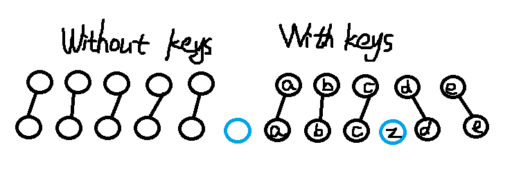

# React 的 diff 算法
## Diff 算法
  在深入实现的细节之前，需要了解一下 React 怎样工作的

```
  var MyComponent = React.createClass({
    render: function(){
      if ( this.props.first ){
        return <div className="first"><span>A Span</span></div>;
      } else {
        return <div className="second"><p>A Paragraph</p></div>;
      }
    }
  })
```

  render执行的结果得到的不是真正的 DOM 节点。结果仅仅是轻量级的 JavaScript 对象，称之为 virtual DOM。<br>

  React 要从这个表现形式当中尝试找到前一个渲染结果到后一个的最小步数。比如，当我们挂载了 ```<MyComponent first={true}/>```，然后用 ```<MyComponent first={false} />``` 替换，然后又取消挂载，这样一个过程的 DOM 的指令是这样的：<br>

  从没有到第一步

  * 创建节点：```<div className="first"><span>A Span</span></div>```

  从第一步到第二步

  * 替换树形：className = "first" 到 className = "second"
  * 替换节点：```<span>A Span</span> 到 <p>A Paragraph</p>```

  从第二步到没有

  * 删除节点：```<div className="second"><p>A Paragraph</p></div>```

#### 按照层级

  找到两棵任意的树之间最小的修改是一个复杂度为O(n³)的问题，React 用了一种简单但是强大的技巧，达到了接近 O(n) 的复杂度。<br>

  React 仅仅是尝试把树按照层级分解。这彻底简化了复杂度，而且也不会失去很多，因为 Web 应用很少有 component 移动到树的另一个层级去。它们大部分只是在相邻的子节点之间移动。 <br>

  

#### 列表

  假如我们有个 component，一个循环渲染了 5 个 component，随后又在列表中间插入一个新的 component。默认情况下，React 会将前一个列表第一个component 和后一个第一个关联起来，后面也是。你可以写一个 key 属性帮助 React 来处理它们之前的对应关系。实际中，在子元素中找到唯一的 key 通常很容易。

  

#### Component

  React app 通常由用户定义的 component 组合而成，<br>
  通常结果是一个主要是很多 div 组成的树。<br>
  这个信息也被 React 的 diff 算法考虑进去，React 只会匹配相同 class 的 component <br><br>

  比如，如果有个 `<Header>` 被 `<ExampleBlock>` 替换掉了，<br>
  React 会删除掉 header 再创建一个 example block。<br>
  我们不需要花宝贵的时间去匹配两个不大可能有相似之处的 component <br><br>

  

## 事件代理

  往 DOM 节点上绑事件慢的让人心碎啊，而且很费内存。<br><br>

  作为替代，React 部署了种流行技术，叫做“事件代理”.<br>
  React 走的更远，重新实现了一遍符合 W3C 规范的事件系统. <br>
  意味着 IE8 事件处理的 bug 成为过去了，所有事件名称跨浏览器保持一致。<br><br>

  这里解释一下怎么实现的。事件 listener 被绑定到整个文档的根节点上。<br>
  当事件被触发，浏览器会给出一个触发的目标的 DOM 节点。<br>
  为了在 DOM 的层级传播事件，React 不会迭代 virtual DOM 的层级。<br>
  而是，我们依靠每个 React component 各自独立的 id 来编码这个层级。<br>
  我们能通过简单的字符串操作来获取所有父级 component 的父级内容。<br>
  把事件 listener 存储在 hash map 当中，我们发现性能比放到 virtual DOM 还要好。 <br>
  这个例子展示了，当一个事件广播到整个 virtual DOM 时发生什么。

```
  // dispatchEvent('click', 'a.b.c', event)
  clickCaptureListeners['a'](event);
  clickCaptureListeners['a.b'](event);
  clickCaptureListeners['a.b.c'](event);
  clickBubbleListeners['a.b.c'](event);
  clickBubbleListeners['a.b'](event);
  clickBubbleListeners['a'](event);
```

  浏览器为每个事件和每个 listener 创建一个新的事件对象。<br>
  这个事件对象的属性很不错，你能获取到事件的引用，甚至修改掉。<br>
  然而这也意味着高额的内存分配。<br>
  React 在启动时就为那些对象分配了一个内存池。<br>
  任何时候需要用到事件对象，就可以从这个内存池进行复用。<br>
  这一点非常显著的减轻了垃圾回收的负担。<br>

## 渲染
#### 合并操作

  你调用 component 的 setState 方法的时候，React 将其标记为 dirty。<br>
  到每一个事件循环结束，React 检查所有标记 dirty 的 component 重新绘制。<br><br>

  这里的“合并操作”是说，在一个事件循环当中，DOM只会被更新一次。<br>
  这个特性是构建高性能应用的关键。而且用通常的 JavaScript 代码难以实现。<br>
  而在 React 应用里，你默认就能实现。<br><br>

  

#### 子树渲染

  调用 setState 方法时，component 会重新构建包括子节点的 virtual DOM .<br>
  如果你在根节点调用 setState，整个 React 的应用都会被重新渲染。<br>
  所有的 component，即便没有更新，都会调用他们的 render 方法。<br>
  这个听起来可怕，性能像是很低，但实际上我们不会触碰真实的 DOM，运行起来没那样的问题。<br><br>

  首先，我们讨论的是展示用户界面。因为屏幕空间有限，通常你需要一次渲染成百上千条指令。JavaScript对于能处理的整个界面， 在业务逻辑上已经足够快了。<br><br>

  另一点，在写 React 代码时，每当有数据更新，你不是都调用根节点的 setState.<br>
  你会在需要接收对应更新的 component 上调用，或者在上面的几个 component。<br>
  你很少要一直到根节点上。就是说界面更新只出现在用户产生交互的局部。<br><br>

  

#### 选择性子树渲染

  最后，你还有可能去掉一些子树的重新渲染。如果你在 component 上实现以下方法的话：

```
  boolean shouldComponentUpdate(object nextProps, object nextState)
```

  根据component 的前一个和下一个props/state，<br>
  你可以告诉 React 这个component没有更新，也不需要重新绘制。<br>
  实现的好的话，可以带来巨大的性能提升。<br><br>

  要用这个方法，你要能够对 JavaScript Object 进行比对，<br>
  这件有很多细节的因素，比如对比应该是深度的还是浅层的，<br>
  如果要深的，我们是用不可变数据结构，还是进行深度拷贝...<br><br>

  而且你要注意，这个函数每次都会被调用，所以你要确保运行起来花的时间更少，<br>
  比 React 的做法时间少，还有比计算 component 需要的事件少，<br>
  即便重新绘制并不是必要的。<br><br>

  

## 结论

  帮助 React 变快的技术并不新颖，长久以来，我们到知道触碰 DOM 是费时的，你应该合并处理读和写的操作，事件代理会更快...<br><br>

  任何还是会经常讨论他们，因为在实际当中用 JavaScript 进行实现还是挺难的。<br>
  React 突出的一个原因是这些优化默认就启动了.<br>
  这就让你避免掉不小心把 app 写的很慢<br><br>

  React 消耗性能的模型很简单，很好理解：每次调用 setState 会重新计算整个子树。<br>
  如果你想要提高性能，尽量少调用 setState，<br>
  还有用 shouldComponentUpdate 减少大的子树的重新计算。
